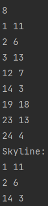
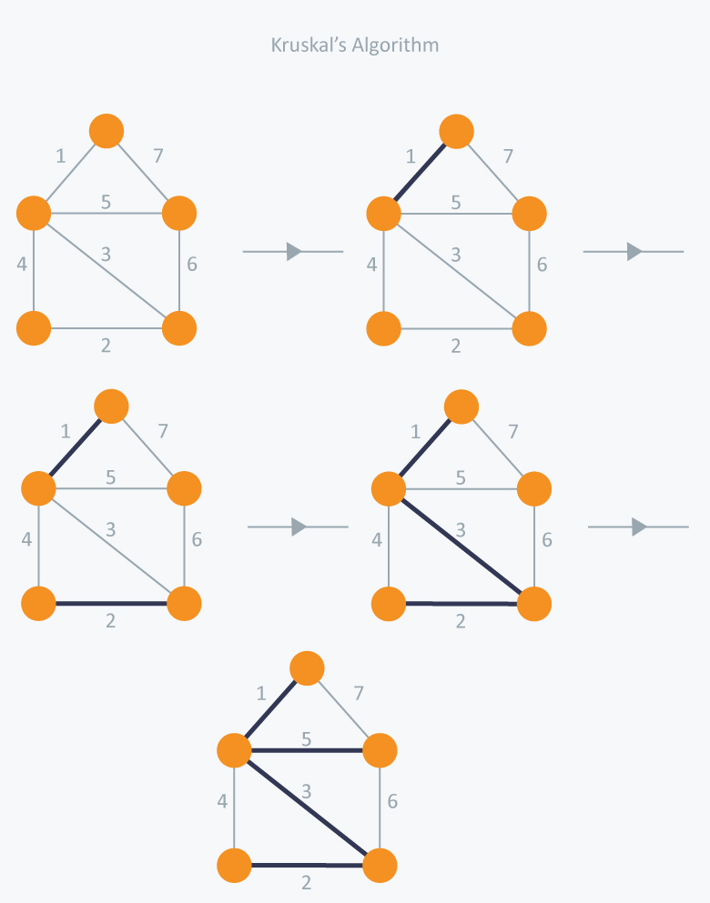

# algorithms
Collections of Different Algorithms implemented in c++
## Algorithms Implemented
* Skyline
* Kruskal's Algorithm to find Minimum Spanning Tree
## Description
### Skyline
Given n rectangular buildings in a 2-dimensional city, computes the skyline of these buildings, eliminating hidden lines. 
The main task is to view buildings from aside and remove all sections that are not visible. 
#### Input
All buildings share common bottom and every building is represented by a pair (left, ht)
* left: is x coordinated on the left side (or wall).
* ht: is the height of the building.
#### Output
A skyline is a collection of rectangular strips. 
A rectangular strip is represented as a pair (left, ht) where left is x coordinate of the left side of strip and ht is the height of strip. 

###  Minimum Spanning Tree
#### Spanning tree
A spanning tree is a sub-graph of an undirected connected graph, which includes all the vertices of the graph with a minimum possible number of edges. If a vertex is missed, then it is not a spanning tree.

The edges may or may not have weights assigned to them.
#### Minimum Spanning Tree
A minimum spanning tree is a spanning tree in which the sum of the weight of the edges is as minimum as possible.

##### Kruskal’s Algorithm
Kruskal’s Algorithm builds the spanning tree by adding edges one by one into a growing spanning tree. Kruskal's algorithm follows greedy approach as in each iteration it finds an edge which has least weight and add it to the growing spanning tree.

##### Algorithm Steps:
* Sort the graph edges with respect to their weights.
* Start adding edges to the MST from the edge with the smallest weight until the edge of the largest weight.
* Only add edges which doesn't form a cycle , edges which connect only disconnected components.

